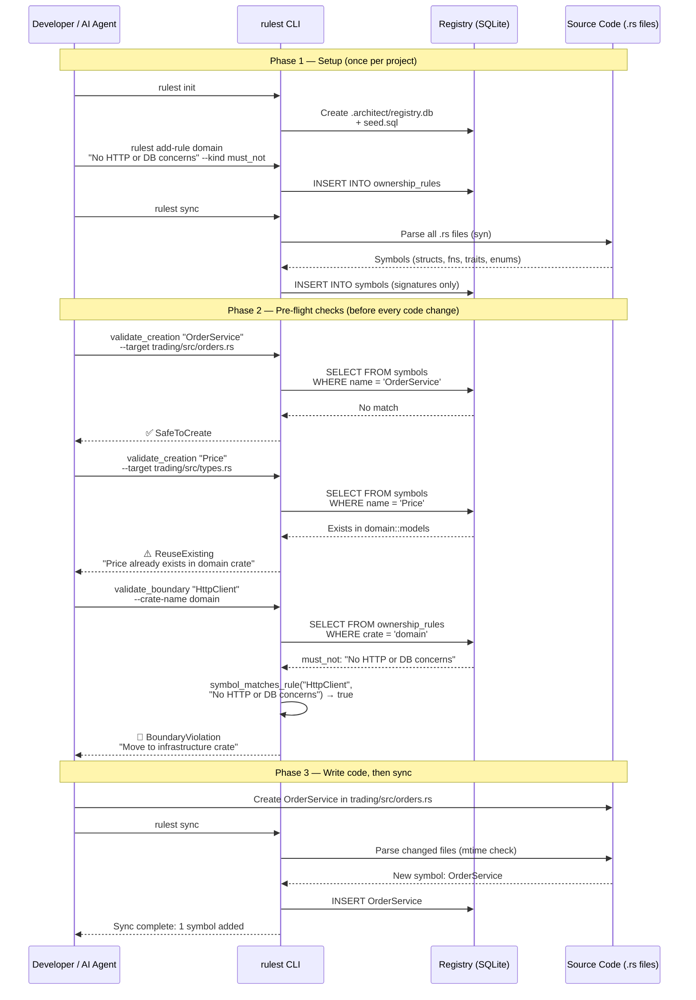
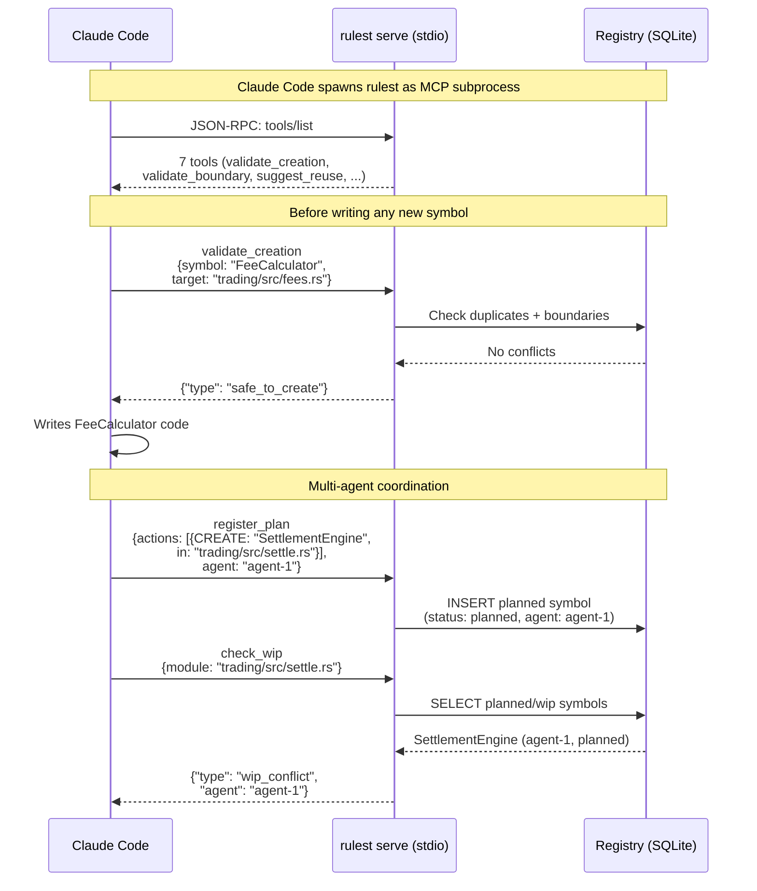

# rulest

Architecture Registry & MCP Oracle for Rust projects.

A CLI tool and MCP server that any Rust workspace can adopt to prevent AI agents from creating duplicate symbols, violating module boundaries, or reinventing existing types. Think `cargo-audit` but for architectural integrity during vibe coding.

For the principles and theory behind this tool, read [The Minesweeper Problem](the-minesweeper-problem.md).

## How It Works



### MCP Server Mode (Claude Code Integration)



## Installation

```sh
cargo install --path crates/rulest-cli
```

Or build from source:

```sh
git clone https://github.com/etanoir/rulest.git
cd rulest
cargo build --release
# binary is at target/release/rulest
```

## Quick Start

### 1. Initialize the registry

From your Rust workspace root:

```sh
rulest init
```

This creates an `.architect/` directory containing:

- `registry.db` — SQLite database with the architecture schema (gitignore this)
- `seed.sql` — ownership rules as versionable SQL (commit this)

### 2. Define ownership rules

Tell the registry what each crate is responsible for:

```sh
rulest add-rule domain "No infrastructure concerns (DB, HTTP, filesystem)" --kind must_not
rulest add-rule domain "All business types use newtype pattern" --kind must_own
rulest add-rule trading "Consume domain::Price, do not define own currency type" --kind must_not
```

Rule kinds:

| Kind | Meaning |
|------|---------|
| `must_own` | This crate is the authoritative owner of this concern |
| `must_not` | This crate must not contain this kind of code |
| `shared_with` | This concern is shared across crates |

### 3. Sync source code into the registry

```sh
rulest sync
```

This parses every `.rs` file in the workspace using `syn` and populates the registry with symbols — functions, structs, enums, traits, type aliases, constants. Only signatures are stored, never function bodies.

Sync is incremental by default (based on file mtime). Force a full resync with:

```sh
rulest sync --full
```

### 4. Query the registry

Look up a symbol:

```sh
rulest query calculate_fee
```

Validate before creating a new function:

```sh
rulest query --validate-creation calculate_settlement_fee --target crates/trading/src/fees.rs
```

Check if a type already exists:

```sh
rulest query --validate-dependency CurrencyAmount
```

Check boundary rules:

```sh
rulest query --validate-boundary HttpClient --crate-name domain
```

Check for work-in-progress conflicts:

```sh
rulest query --check-wip src/fees
```

Search for reusable code:

```sh
rulest query --suggest-reuse "calculate trading fees"
```

All queries return structured JSON with advisory types: `safe_to_create`, `reuse_existing`, `use_existing_type`, `boundary_violation`, `wip_conflict`, `ambiguous_match`, or `reuse_with_pattern`.

### 5. Connect to Claude Code as an MCP server

Add to your Claude Code MCP configuration:

```json
{
  "mcpServers": {
    "rulest": {
      "command": "rulest",
      "args": ["serve", "--db", ".architect/registry.db"]
    }
  }
}
```

The MCP server exposes seven tools over JSON-RPC (stdio):

| Tool | Question it answers |
|------|-------------------|
| `validate_creation` | Does this symbol already exist? |
| `validate_dependency` | Who provides this type/trait? |
| `validate_boundary` | Does placing this here violate ownership rules? |
| `check_wip` | Is someone else working in this area? |
| `suggest_reuse` | What existing code can I reuse for this? |
| `register_plan` | Register planned symbols from an AI plan into the registry. Enables conflict detection via `check_wip` for multi-agent coordination. Takes `actions` (array of planned actions) and `agent` (agent identifier). |
| `validate_plan` | Validate an entire structured plan against the registry. Checks each action for conflicts, duplicates, boundary violations, and WIP conflicts. Returns a report with per-action advisories and a summary. Takes `actions` (array of planned actions). |

### 6. Scaffold CLAUDE.md and settings for a project

```sh
rulest scaffold
```

Generates `CLAUDE.md` (root and per-crate), `.claude/settings.json` with deny rules, and `.architect/seed.sql` — all pre-filled with your workspace's actual crate names. Existing files are not overwritten.

### 7. Validate a plan file

```sh
rulest validate <plan> [--db <path>]
```

Validate a structured plan file against the registry. The plan file uses a simple text format:

```
CREATE: fn calculate_settlement_fee
  in: crates/trading/src/fees.rs

MODIFY: fn execute_settlement
  in: crates/trading/src/settlement.rs
```

Each action is checked for duplicates, boundary violations, and WIP conflicts. Returns a JSON report with per-action advisories and a summary.

### 8. Register planned symbols

```sh
rulest register-plan <plan> [--agent <name>] [--db <path>]
```

Register planned symbols from a plan file into the registry with status `planned`. This is Trigger 2 (Post-Plan Registration) from the Minesweeper architecture — it enables conflict detection via `check_wip` for multi-agent coordination.

### 9. Build and sync

```sh
rulest build [--workspace <path>] [-- <cargo-args>...]
```

Build the workspace and automatically sync the registry. Equivalent to running `cargo build` followed by `rulest sync`. Implements the article's Post-Compile Sync trigger. Additional cargo arguments are passed through (e.g., `rulest build -- --release`).

## Important Usage Notes

### What to commit, what to gitignore

```gitignore
# .gitignore
.architect/registry.db
.architect/registry.db-*
.architect/sync.log
.architect/sync.lock
```

Commit `.architect/seed.sql` — it contains your architectural decisions and is the source of truth for ownership rules. The database is rebuilt from source code + seed on any machine.

### Keep the registry in sync

Run `rulest sync` after significant code changes. The registry is only as useful as it is current. A stale registry will miss new symbols and may give incorrect advisories.

For best results, sync after every successful build:

```sh
cargo build && rulest sync
```

### Ownership rules are your main lever

The registry's power comes from the rules you define. Start with a few high-value rules:

- Mark your domain crate as `must_not` for infrastructure concerns
- Mark shared crates as `shared_with` to signal intentional cross-cutting
- Revisit rules as the architecture evolves

### Advisory responses guide, not block

Queries return advisories, not hard errors. The AI agent (or human) decides what to do with them. This is by design — the tool provides architectural awareness, not enforcement. Use `settings.json` deny rules for hard enforcement on critical files.

### FFI function detection

The indexer detects FFI functions — any function with an explicit ABI (`extern "C"`, `extern "system"`, `extern "stdcall"`, etc.), `#[no_mangle]`, or `#[export_name]` attributes. These are indexed as `ffi_function` kind. Functions inside `extern "C" { }` blocks are also captured.

### Generic parameters in signatures

Signatures include full generic parameters and lifetimes. `fn process<T: Clone + Send>(x: T) -> T` is stored with generics intact, not stripped to `fn process(x: T) -> T`.

### Content-based incremental sync

Sync uses SHA-256 content hashes (not file modification times) to detect changes. This means `git checkout`, `git rebase`, and `git stash pop` won't cause stale registries. Old sync.log files from pre-1.2.0 will trigger an automatic full resync.

### Pattern-based boundary rules

In addition to text-based matching, ownership rules support glob and regex patterns for precise symbol matching:

```sh
# Glob patterns (comma-separated)
rulest add-rule core "No SQL types" --kind must_not --pattern "Sql*,*Repository,Pg*"
rulest add-rule core "No PKCS#11 types" --kind must_not --pattern "CK_*"

# Regex patterns
rulest add-rule db "No business logic" --kind must_not --regex "^(Issue|Revoke|Renew)"
```

Pattern rules are checked before text-based matching. Both rule types can coexist on the same crate.

### Pre-commit hook integration

Check staged files for architecture violations before committing:

```sh
rulest check --changed-only [--db <registry.db>]
```

Check a single file:

```sh
rulest check-file <path> [--db <registry.db>]
```

Example pre-commit hook:

```bash
#!/bin/sh
rulest sync --full && rulest check --changed-only
```

Exit codes: `0` (pass), `1` (warnings), `2` (errors).

### Cross-repo registry linking

When multiple repos share types, link their registries for cross-repo duplicate detection:

```sh
rulest link --name rustsm --db-path ../rustsm/.architect/registry.db
rulest link --list
rulest link --refresh   # re-sync all linked registries
rulest link --remove rustsm
```

Linked symbols are checked transparently by `validate_creation` — if a symbol exists in a linked registry, it returns `reuse_existing` with source attribution.

### MCP auto-validate mode

Enable proactive validation in the MCP server:

```sh
rulest serve --db .architect/registry.db --auto-validate
```

In this mode, the server responds to `notifications/file_changed` by parsing the file and returning advisories — no explicit tool calls needed.

### Concurrency

Rulest uses file-based locks (`.architect/sync.lock`, `.architect/init.lock`) to prevent concurrent operations from corrupting the registry. If a sync or init is already running, the second invocation will fail with a clear error message. Stale locks are automatically cleaned up (10 minutes for sync, 2 minutes for init).

The MCP server is single-threaded (stdio-based). Multiple Claude Code sessions should each have their own MCP server instance.

### The registry stores signatures, not code

The indexer extracts names, types, visibility, and signatures. It never stores function bodies or implementation details. A 50,000-line codebase produces roughly 500 registry rows (~300 KB).

## CLI Reference

```
rulest init            [-w <Cargo.toml>]          Initialize the registry
rulest add-rule        <crate> <desc> [-k <kind>] [--pattern <globs>] [--regex <pattern>]
                                                  Add an ownership rule
rulest sync            [-w <Cargo.toml>] [--full] Sync source code into registry
rulest query           [symbol]                   Look up a symbol
rulest query           --validate-creation <name> --target <module>
rulest query           --validate-dependency <type>
rulest query           --validate-boundary <name> --crate-name <crate>
rulest query           --check-wip <module_path>
rulest query           --suggest-reuse <description>
rulest validate        <plan> [--db <path>]       Validate a plan file against the registry
rulest register-plan   <plan> [--agent <name>] [--db <path>]
                                                  Register planned symbols into the registry
rulest build           [--workspace <path>] [-- <cargo-args>...]
                                                  Build workspace and sync registry
rulest serve           [-d <registry.db>] [--auto-validate]
                                                  Start MCP server (stdio)
rulest scaffold        [-w <Cargo.toml>]          Generate project templates
rulest check-file      <file> [--db <path>]       Check a file for architecture violations
rulest check           --changed-only [--db <path>]
                                                  Check staged files (pre-commit hook)
rulest link            --name <n> --db-path <p>   Link an external registry
rulest link            --list | --refresh | --remove <name>
                                                  Manage linked registries
```

## License

MIT
